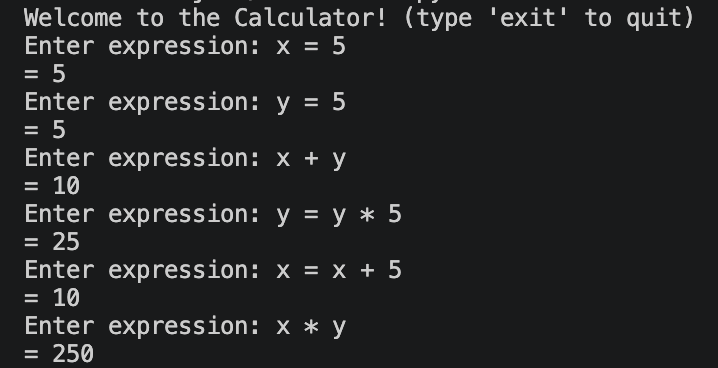
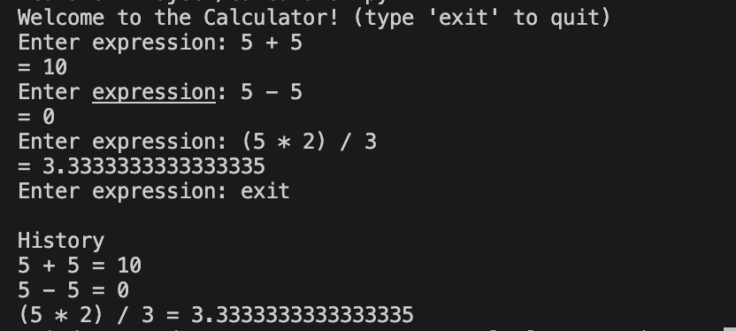

# AST-Based Calculator (Python)
An average, simple calculator built with Python using the data structure Abstract Syntax Tree (AST). 
This calculator supports variables, arithmetic operations, and variable evaluation by using the AST library. 

---

**Features:**
- Variable Assignment
- Expression Evaluation
- Basic Operations:
  - Addition
  - Subtraction
  - Multiplication
  - Division
  - Exponentiation
- Unary Operations (e.x. -x)
- History Panel
- Built with Python's Abstract Syntax Tree (AST)

The functions as of right now consist of adding, multiplying, subtracting and dividing. All history will be stored for each round until the user stops using the calculator. History can be accessed by typing in a number specified in the code. 

---

**Information on the Calculator:**
This calculator uses the foundationals of Object-Oriented Programming (OOP) and is built in AST data structure in the Python library to parse data structures into a mathematical tree. Each part of the equation is seperated by it's value and evaluated recursively, allowing a safe and reliable execution instead of the eval() library in order to make sure the user only types in what is necessary to maintain privacy and efficiency.

---

**Examples:**

***Variable Assignment:***

***Expression Evaluation:***

